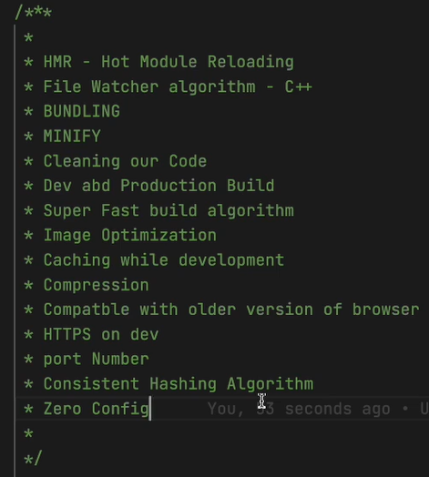

Ep1 : INCEPTION

- react is a library
- library vs framework
- read about emmets
- we can inject React in HTML using CDN Links using script tags
- react.createelement gives an object
- react element is an object
- const element = createElement(type, props, ...children)

- if react used in html, react will override whatever is exisiting in html part of the root section. react will replace it with whatever you mention inside rneder.
- when you build a whole website using pure html css js, it gets big. So you can specify components in which you want React to act. Rest all will be untouched.
    For instance :
        

        

        

    Here you can tell the react to take only the div with id root and apply react to it.

    For eg: You have a big project & you want to use React just in your Search Bar, you can do that.

-   if react used in html, react will override whatever is exisiting in html part of the root section or the section specified as root. react will replace it with whatever you mention inside rneder.
        
    Hence a PRO TIP : developer always write "NOT RENDERED" inside the html root
    This way anytime you see NOT RENDERED text message appearing on your app, you knwo there's a problem
    Problems like : some issue : or React is not there : or Root is not configured properly

- When we have to pass multiple React Elements in a particular component / div / React element, we pass an array in the form of [] square brackets.

    Eg : 
    const foo1 = React.createElement('h3', {
        id:'react=footer',
        className:'bold',
    }, 'React footer1')
    const foo2 = React.createElement('h3', {
        id:'react=footer',
        className:'bold',
    }, 'React footer2')

    const container = React.createElement('div',{
        id:'container'
    },[foo1,foo2] );

- Diff b/w react-dev.js & react-prod.js in cdn links : react-prod.js contains minified & more optimised version of react-dev.js

Ep2 : CHIT CHAT

Ep3 : Igniting our app
- To ignite our app, we need to use something called as **BUNDLERS** like **Webpack , Vite , Parcel**
- Bundlers give us a lot of superpowers
- we are creating our own version of create-react-app that helps us ignite a react app
- in the original create-react-app, they've used webpack as a bundler
- we will be using **Parcel**
- Difference b/w webpack & parcel
- why use npm ? because a react app uses multiple packages each with different set of services & those helper pckages can be installed & managed using npm
- package.json vs package-lock.json : 
    package-lock.json specifies the exact version of a package & all other dependent packages our project depends on
- npx means execute using npm

- Parcel does HMR (Hot Module Reloading). Every time you save your changes, it automatically reloads & changes. Parcel uses File Watcher Algorithm (which is written in C++) by keeping a track of all the file changes in realtime & reload on every save
- While building a prod-build using parcel, we don't require :   // "main": "app.js", in package.json. It defines entry point for our app. Not needed in parcel, it gives error.

- npx parcel index.html        : dev build
- npx parcel build index.html  : prod build

- Parcel Documentation : https://parceljs.org/docs/

- Advantages of Parcel:

