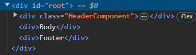

Ep1 : INCEPTION

- react is a library
- library vs framework
- read about emmets
- we can inject React in HTML using CDN Links using script tags
- react.createelement gives an object
- react element is an object
- const element = createElement(type, props, ...children)

- if react used in html, react will override whatever is exisiting in html part of the root section. react will replace it with whatever you mention inside rneder.
- when you build a whole website using pure html css js, it gets big. So you can specify components in which you want React to act. Rest all will be untouched.
    For instance :
        <div id="header" />
        <div id="root" />
        <div id="footer" />
    Here you can tell the react to take only the div with id root and apply react to it.

    For eg: You have a big project & you want to use React just in your Search Bar, you can do that.

-   if react used in html, react will override whatever is exisiting in html part of the root section or the section specified as root. react will replace it with whatever you mention inside rneder.
        
    Hence a PRO TIP : developer always write "NOT RENDERED" inside the html root
    This way anytime you see NOT RENDERED text message appearing on your app, you knwo there's a problem
    Problems like : some issue : or React is not there : or Root is not configured properly

- When we have to pass multiple React Elements in a particular component / div / React element, we pass an array in the form of [] square brackets.

    Eg : 
    const foo1 = React.createElement('h3', {
        id:'react=footer',
        className:'bold',
    }, 'React footer1')
    const foo2 = React.createElement('h3', {
        id:'react=footer',
        className:'bold',
    }, 'React footer2')

    const container = React.createElement('div',{
        id:'container'
    },[foo1,foo2] );

- Diff b/w react-dev.js & react-prod.js in cdn links : react-prod.js contains minified & more optimised version of react-dev.js


Ep2 : CHIT CHAT


Ep3 : Igniting our app : Parcel ( Bundler )
- To ignite our app, we need to use something called as **BUNDLERS** like **Webpack , Vite , Parcel**
- Bundlers give us a lot of superpowers
- we are creating our own version of create-react-app that helps us ignite a react app
- in the original create-react-app, they've used webpack as a bundler
- we will be using **Parcel**
- Difference b/w webpack & parcel
- why use npm ? because a react app uses multiple packages each with different set of services & those helper pckages can be installed & managed using npm
- package.json vs package-lock.json : 
    package-lock.json specifies the exact version of a package & all other dependent packages our project depends on
- npx means execute using npm

- Parcel does HMR (Hot Module Reloading). Every time you save your changes, it automatically reloads & changes. Parcel uses File Watcher Algorithm (which is written in C++) by keeping a track of all the file changes in realtime & reload on every save
- While building a prod-build using parcel, we don't require :   // "main": "app.js", in package.json. It defines entry point for our app. Not needed in parcel, it gives error.

- npx parcel index.html        : dev build
- npx parcel build index.html  : prod build

- Parcel Documentation : https://parceljs.org/docs/

- Advantages of Parcel:


Ep 4: Laying the Foundation : Babel
- Babel coverts modern JS (E6) to older Javascript so that it can run on past/old versions of JS runtimes / web browsers

- babel-plugin-transform-remove-console removes errors & console logs from console
- Babel.rc is a babel config file


    document.createElement    BROWSER API
    | |
    v
    React.createElement     REACT API
    | |
    v
    Direct Html tags        JSX

- Initial philosphy while creating React : Update HTML using JS easily

- JSX : JSX is HTML like syntax inside JS.
- JSX uses React.createElement
    So the flow is : JSX -> React.createElement -> Object -> HTML DOM

- Babel reads your code line by line and then creates Abstract Syntax Tree, hence it converts jsx to normal html & js compatible with browser.

- Difference b/w html & jsx, & different usage of jsx, syntax of jsx

- Example of JSX being coverted to React API Code


- Babel comes along with parcel as a dependency

- Everything is a componenet in React

- REACT COMPONENTS
    - Functional Based : New Way of writing code
    - Class Based : Old Way of writing code

- functional component : JS function that returns your JSX code / react element / component. Its a normal function.

- In functional componenet name of the component should always start from the Capital Letter. Its a convention.

    Eg: 
    ```
    const FunctionalComponent = () => {
        return (
            <h1 id="humaraHeader">Yeh Humara Header hai</h1>
        );
    };
    ```

    can also be written without using return & extra brackets:
    ```
    const FunctionalComponent = () => (
        <h1 id="humaraHeader">Yeh Humara Header hai</h1>
    );
    ```

- Jargon : Composing Componenets - components inside componenets.

Ep5 : Talk is cheap, show me the code 
Creating a food ordering app.

- To select css properties inside of inside we use > .
    Eg :  <div className="nav-items">
                <ul>
                    <li>Home</li>

    So to access <li> and give it CSS properties we will use :
    ``` 
        .nav-items > ul > li {

        }
    ```

- Any piece of JSX Component, there can only be one parent.
- Because we can only have one JSX, we have react Fragment.
- React.Fragment is a component which is exported by React

- Eg : 
    This will work :
    ```
    return(
        <React.Fragment>
            <HeaderComponent />
            <BodyComponenet />
            <FooterComponenet />
        </React.Fragment>
    )
    ```

    ```
    <!-- React.Fragment is too long to write, hence one can use empty tags also, it is one and the same thing -->
    return(
        <>
            <HeaderComponent />
            <BodyComponenet />
            <FooterComponenet />
        </> 
    )
    ```

    This won't work:
    ```
    return(
            <HeaderComponent />
            <BodyComponenet />
            <FooterComponenet />
    )
    ```

    This is because normally return accepts just one div. In that
    div you can further add further components / other divs. 
    In the DOM, there is an additional DIV which is not necessary

    

    When we use React Fragement, we don't get an additional div.

    

- <> </> is a shorthand for <React.Fragment> </React.Fragment>

- Config Driven UI : We control our frontend user interface using a config , 
for different use cases. Is a technique that allows you to 
create user interfaces based on a configuration file, such as JSON, or a 
TypeScript file that defines the layout and content of the UI components.

- Optional Chaining JS

- Whatever you pass in with a component as an attribute is known as a prop.
    Helps in passing some data or some properties in our functional component
    We pass in arguments & recieve parameters
    Whenever you pass props inside functional component as arguments, you recieve it as a parameter wherever you call it.

    [] Argument vs parameters, namasteJS
    [] Map function, namasteJS

- virtual DOM : representation of our actual DOM

- reconciliation : algorithm that react uses to diff one tree from other (actual dom tree vs virtual dom tree), determines what needs to be changed in UI / updated in UI & just updates the small portion of the DOM instead of re-rendering the whole page/app.

- Why we use key & how it helps during React reconciliation? if key is used, it exactly renders / adds / subracts the componenet instead of rendering all
- NEVER use "index" that comes with "map" function as your key

- React Fiber (new reconciliation engine responsible for diff)